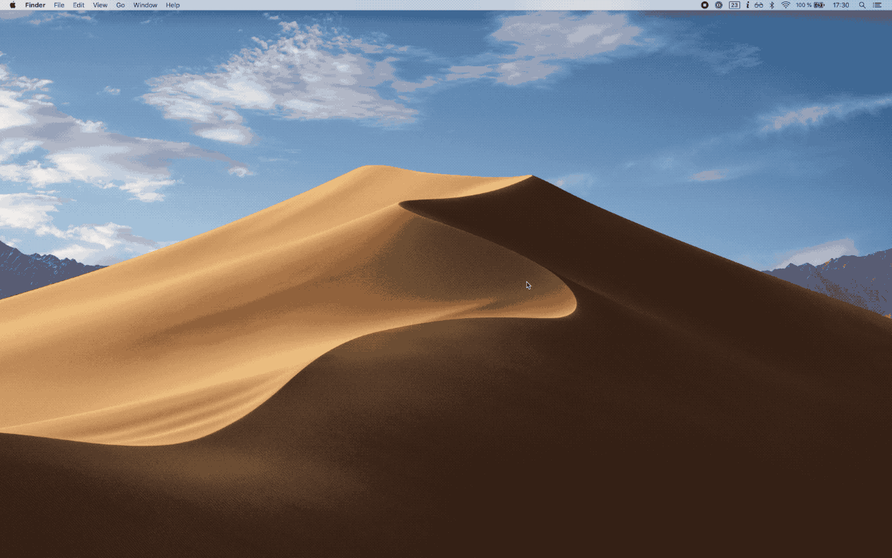
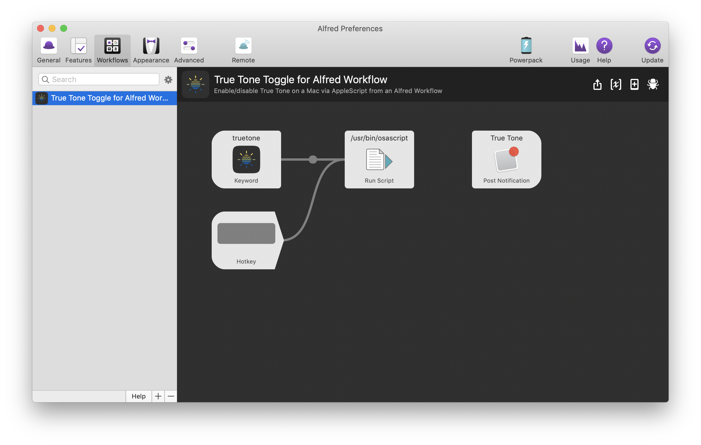

# Alfred True Tone Workflow
An Alfred workflow to toggle True Tone via AppleScript on a Mac

This workflow lets you enable/disable the 'True Tone' feature on your Mac with an Alfred keyword (truetone).
It's really useful for when you are e.g. a designer and enjoy reading websites, texts etc. with True Tone enabled but need to view accurate colors while you work.

Since Apple does not provide a special System Event (yet?), the toggle is being changed by GUI scripting.

It is also possible to add a global hotkey/shortcut or notification after running the workflow (see screenshot at the bottom).

## Demo

## Workflow structure

